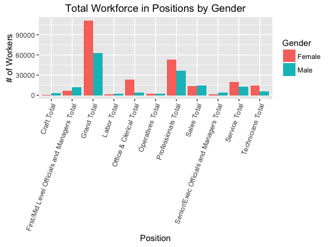
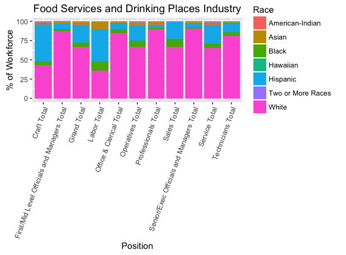

##The Source
I chose to analyze a data set from data.gov about Job Patters for Minorities and Women In Private Industries using YEAR09_CBS_NAC3.txt


##The Process
The process was heavily guided by "Tidy Data" by Hadley Wickham 2014

###Step 1
To interpret the data I needed to relable all columns with appropriate titles using the data dictionary excell file. I kept in mind some columns would need to be split up and put in propper notation accordingly.

###Step 2
At this point the data set was still very large so I focused my analysis on the area of Boston- Cambridge- Quincy. 
Furthermore, I removed columns with with entries that were not able to be interpreted because they were not on the ledgend. I also removed columns of city and state because they no longer held significance. 

###Step 3
Next, I melted the data, turning columns representing observations into rows using the following code:
```
library(reshape)
melted <- melt(data, id=c("Industry"))
```
###Step 4
As follows, some columns needed to be split into several columns. For instance, one column contained the information of: race, gender, type of data, and position. It was at this step that I made use of the way I renames the coulmns. To seperate the columns I did:
```
library(tidyr)
split <- separate(melted, variable, c("Race", "Gender", "Type", "Position"), sep = ":")
```
###Step 5
At this point, I checked for and deleted rows with NA entries. Using Hadley Wickhams' advice, "Structural missing values, which represent measurements that cannot be made can be safely removed".
```
split <- subset(split, !is.na(value))
```
###Step 6
There now exists a column entitled 'Type' which refers to the data being on of two types of data, either a total number or a percentage. It is good form that each table represents one type of data so I make these into two tables. 
```
totals <- subset(split, Type=="Total")
percentage <- subset(split, Type=="PoW")
```
###Step 7
Finall, a few cosmetic changes. I remove the columns which indicate the type of data because that is now expressed in the title of the table. I also specify that the column titled 'Value' represents total number of workers either as a count or a percentage. 
```
totals <- totals[-c(4)]
percentage <- percentage[-c(4)]
names(totals)[5] <- "Total"
names(percentage)[5] <- "Total"
```

##The Results Visualized 
To make use of this data I modified the tables in a way that one may want to when asking a specific question. 

###Using Total table 
I anticipated that a data analyist may want to look at: the total number of workers in each position in the workforce as it relates to gender (See Figure 1).
So, I modified the table to not look at overall gender or minority. Overall gender is not necessary because we wish to observe the disparity between men and women. Minority is not counted in this case either because it is a quantity which is an aggragate of other race quantities. 
```
totalOverallByGender <- subset(totals, Gender != "Overall" & Race != "Minority")
```




###Using Percentage table 
I anticipated that a data analyist may want to look at: the percentage of workers as borken down by race for each position for any particular industry (See Figure 2).
I choose to look at the Food Service and Driking Places industry. I also modified the table to only look at overall gender and not inculde minority. I only look at overall gender because analysis by gender is not the objective and overall is the aggregate of male and female. Minority is removed in this case because it is a quantity which is an aggregate of other race quantities, including it would skew the results. 

```
percentageFood <- subset(percentage, Gender == "Overall" & Industry == "Food Services and 
Drinking Places" & Race != "Minority")
```
